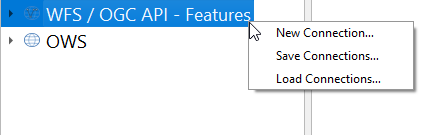
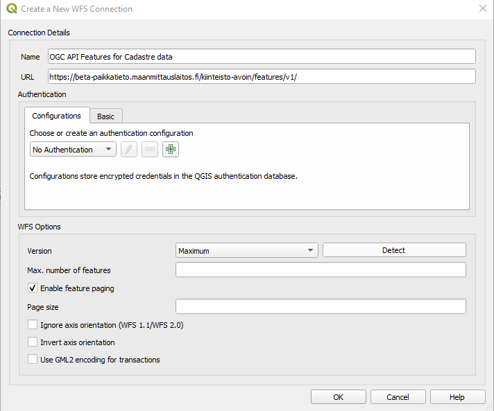
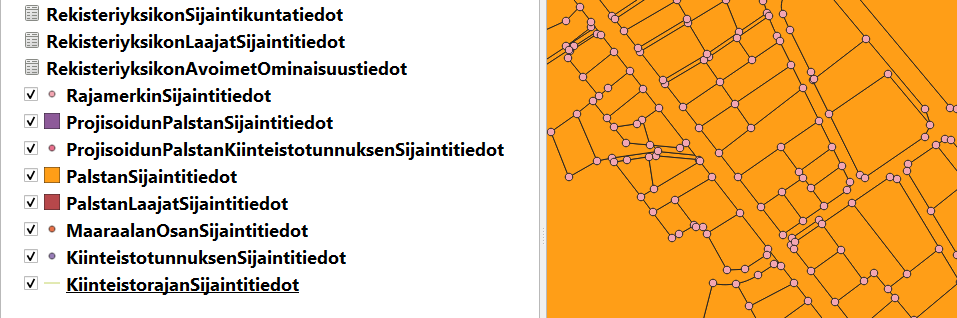
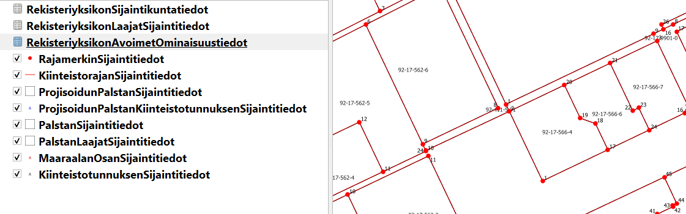

These instructions are made using QGIS 3.16.3-Hannover version. Same kind of procedure is also working with QGIS 3.14.15.

Instructions sort out how to create a connection to the National Survey of Finland’s OGC API -Features service of Cadastre data and how to utilize Cadastre data using QGIS software.

Entry point, so called “landing page”, can be found here. 

https://beta-paikkatieto.maanmittauslaitos.fi/kiinteisto-avoin/features/v1/

Landing page is used as an address to the service. Right click the “<b>WFS / OGC API Features</b>” option to create a connection and select “<b>New Connection…</b>”. 

Type a name and add the address of the Cadastre OGC API Features service to the URL textbox. 

Click <b>OK</b>. 

Eleven Cadastre layers are available to be utilized. Three layers (“RekisteriyksikonSijaintikuntatiedot”, “RekisteriyksikonLaajatSijaintitiedot”, “RekisteriyksikonAvoimetOminaisuustiedot”) are basic database tables without geometry. There are some performance issues with these three layers.

Predefined symbology for OGC API Features for Cadastre data is available. QGIS Style files can be fetched from National Land Survey of Finland’s Github site. Predefined symbology <b>does not</b> follow National Land Survey of Finland’s official symbology for Cadastre data at the moment. 

https://github.com/nlsfi/beta-karttakuva.maanmittauslaitos.fi/tree/master/kipa/kiinteistojaotus-qgis-beta/oapif/ 

Download and save the *.qml files. 
Double click the name of the layer and select the Symbology tab, the Click the Style button for and select Load Style… option. Database Styles Manager window opens. Use the Find button and select just a moment ago downloaded kiinteistojaotus_OAPIF_{layer_name}_qgis.qml file. Click Load Style button. Close the Layer Properties window with OK button.
 
 
