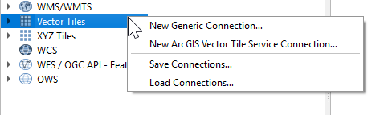
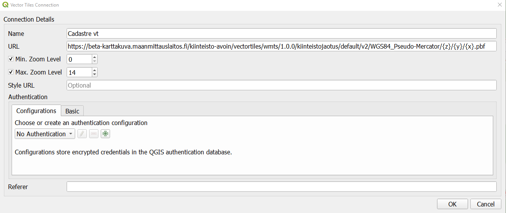
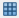
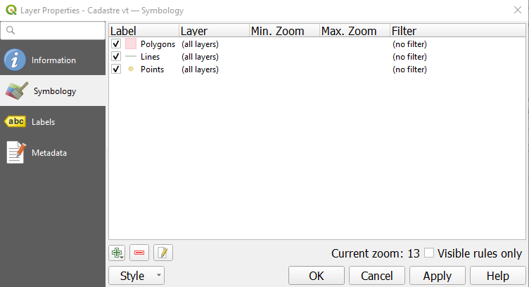
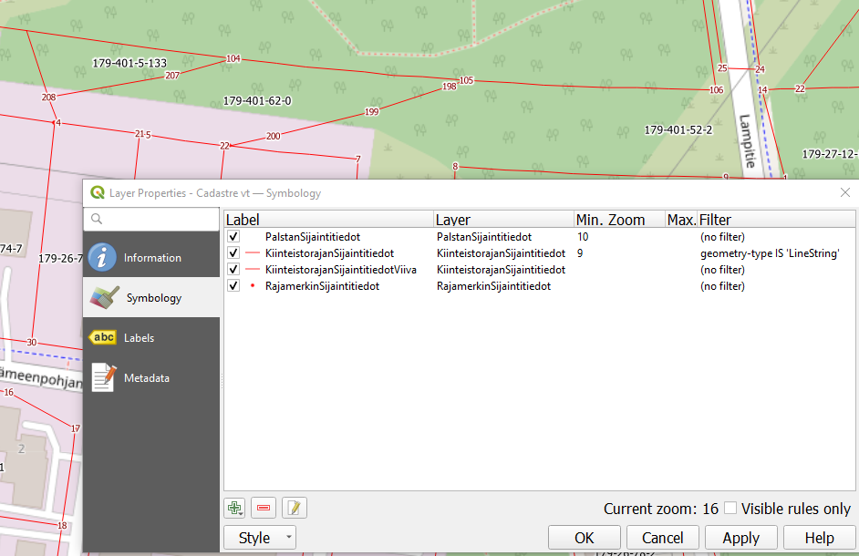

These instructions are made using QGIS 3.16.3-Hannover version. Same kind of procedure is also working with QGIS 3.14.15.

There are some problems how to attach predefined Styles for the vectortile services in QGIS, using Style URL option in the Vector Tiles Connection window.

It is possible to use a QGIS Layer Style File (.qml). 

First user has to create a new connection to the Vector Tile service. Right click a Vector Tiles icon or <b>Vector tiles</b> text on the left hand side window.

Select a <b>New Generic Connection…</b>

Type a name for the connection and add an address to the Vector tile service of Cadastre data. 

URL for Vector Tiles of Cadastre : https://beta-karttakuva.maanmittauslaitos.fi/kiinteisto-avoin/vectortiles/wmts/1.0.0/kiinteistojaotus/default/v2/WGS84_Pseudo-Mercator/{z}/{y}/{x}.pbf?api-key={api-key}

Click <b>OK</b>. Connection is made and user can drag and drop vector tile layers to the map window.

Without styling QGIS add some default colors to the layers. There are four layers in the Cadastre Vector Tiles service. User can by him/herself define a symbology for these layers. Available layers are listed here:

https://beta-karttakuva.maanmittauslaitos.fi/kiinteisto-avoin/tilejson/kiinteistojaotus/default/v2/WGS84_Pseudo-Mercator/tilejson.json

Download and save the QGIS Layer Style File for the Cadastre layers (kiinteistojaotus_qgis.qml) from [here](https://beta-karttakuva.maanmittauslaitos.fi/kipa/kiinteistojaotus_style_beta1/vectortiles/kiinteistojaotus_qgis.qml). 

Double click the icon    or the name of the Cadastre Vector Tiles layer. Layer properties window with Symbology definitions opens.

Click the Style button and select <b>Load Style…</b> option. Database Styles Manager window opens. Use the <b>Find</b> button and select just a moment ago downloaded kiinteistojaotus_qgis.qml file. Click <b>Load Style</b> button. Close the Layer Properties window with <b>OK</b> button.

